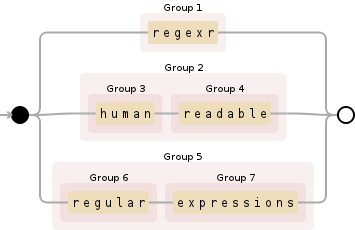

# regexr

[](https://travis-ci.org/trinker/regexr)
[](http://dx.doi.org/10.5281/zenodo.11284)

   

[regexr](http://trinker.github.com/regexr_dev) is an R framework for constructing human readable regular expressions.  It aims to provide tools that enable the user to write regular expressions in a way that is similar to the ways R code is written.  The tools allow the user to (1) write in smaller, modular, named, *regular expression chunks*, (2) write top to bottom, rather than a single string (3) comment idividual chunks, (4) indent expressions to represent regular expression groups, and (5) test the validity of the *concatenated expression* and the modular chunks. 

This framework harnesses the power and flexibility of regular expressions but provides a structural frame that is more consistent with both coding writing and natural language conventions.  The user decides how to break, indent, name, and comment the regular expressions in a way that is human readable, meaningful, and modular.


## Installation

To download the development version of regexr:

Download the [zip ball](https://github.com/trinker/regexr/zipball/master) or [tar ball](https://github.com/trinker/regexr/tarball/master), decompress and run `R CMD INSTALL` on it, or use the **devtools** package to install the development version:

```r
# install.packages("devtools")

devtools::install_github("trinker/regexr")
```

## Help

- [Web Page](http://trinker.github.com/regexr/)     
- [Package PDF Help Manual](https://dl.dropboxusercontent.com/u/61803503/regexr.pdf)   


## Examples

```{echo=FALSE}
library(regexr)
```

### Construction a Regular Expression

The `construct` function creates an object of the class `regexr`.  This is a character string with meta expression information contained in the object's attributes.

Notice that the *regular expression chunks* follow the followingconvention:

> name
-> regular expression
  -> comment


```r
m <- construct(
    space =
        "\\s+"
            %:)%"I see",

    simp =
        "(?<=(foo))",

    or =
        "(;|:)\\s*"
            %:)%"comment on what this does",

    "[a]s th[atey]"
)
m
```

```
## [1] "\\s+(?<=(foo))(;|:)\\s*[a]s th[atey]"
```

### Viewing the regular expression chunks that make up the *concatenated expression*


```r
summary(m)
```

```
## 
## \s+(?<=(foo))(;|:)\s*[a]s th[atey]
## ==================================
## 
## REGEX 1: \s+
## NAME   : space
## COMMENT: "I see"
## 
## REGEX 2: (?<=(foo))
## NAME   : simp
## COMMENT: 
## 
## REGEX 3: (;|:)\s*
## NAME   : or
## COMMENT: "comment on what this does"
## 
## REGEX 4: [a]s th[atey]
## NAME   : 
## COMMENT:
```

### Split `regexr` Object 

The `unglue` function splits the concatenated `regexr` expression into component expression chunks.


```r
unglue(m)
```

```
## $space
## [1] "\\s+"
## 
## $simp
## [1] "(?<=(foo))"
## 
## $or
## [1] "(;|:)\\s*"
## 
## [[4]]
## [1] "[a]s th[atey]"
```

### Get/Set comments, regexes, and names of a `regexr` object.

The `comments`, `regex`, and `names` functions allow the user to view and alter the comments, regexes, and names of a `regexr` object.


```r
regex(m)
```

```
## $space
## [1] "\\s+"
## 
## $simp
## [1] "(?<=(foo))"
## 
## $or
## [1] "(;|:)\\s*"
## 
## [[4]]
## [1] "[a]s th[atey]"
```

```r
comments(m)
```

```
## $space
## [1] "I see"
## 
## $simp
## NULL
## 
## $or
## [1] "comment on what this does"
## 
## [[4]]
## NULL
```

```r
names(m)
```

```
## [1] "space" "simp"  "or"    ""
```

```r
regex(m)[4] <- "(F{O}2)|(BAR)"
comments(m)[4] <- "Look for FOO or BAR"
names(m)[4] <- "foob_bar"
summary(m)
```

```
## 
## \s+(?<=(foo))(;|:)\s*(F{O}2)|(BAR)
## ==================================
## 
## REGEX 1: \s+
## NAME   : space
## COMMENT: "I see"
## 
## REGEX 2: (?<=(foo))
## NAME   : simp
## COMMENT: 
## 
## REGEX 3: (;|:)\s*
## NAME   : or
## COMMENT: "comment on what this does"
## 
## REGEX 4: (F{O}2)|(BAR)
## NAME   : foob_bar
## COMMENT: "Look for FOO or BAR"
```

### Testing Regular Expressions

The `test` function allows the user to check if the concatenated `regexr` expression and component expression chunks are valid regular expressions.


```r
test(m)
```

```
## $regex
## [1] TRUE
## 
## $chunks
##    space     simp       or foob_bar 
##     TRUE     TRUE     TRUE     TRUE
```

```r
regex(m)[5:7] <- c("(", "([A-Z]|(\\d{5})", ")")
test(m)
```

```
## Warning in test.regexr(m): The concatenated regex is not valid
## 
## \s+(?<=(foo))(;|:)\s*(F{O}2)|(BAR)(([A-Z]|(\d{5}))
```

```
## Warning in test.regexr(m): The following regex chunks are not valid in isolation:
## 
## (1) (
## (2) ([A-Z]|(\d{5})
## (3) )
```

```
## $regex
## [1] FALSE
## 
## $chunks
##    space     simp       or foob_bar                            
##     TRUE     TRUE     TRUE     TRUE    FALSE    FALSE    FALSE
```

## Contact

You are welcome to:
* submit suggestions and bug-reports at: <https://github.com/trinker/regexr/issues>
* send a pull request on: <https://github.com/trinker/regexr/>
* compose a friendly e-mail to: <tyler.rinker@gmail.com>

